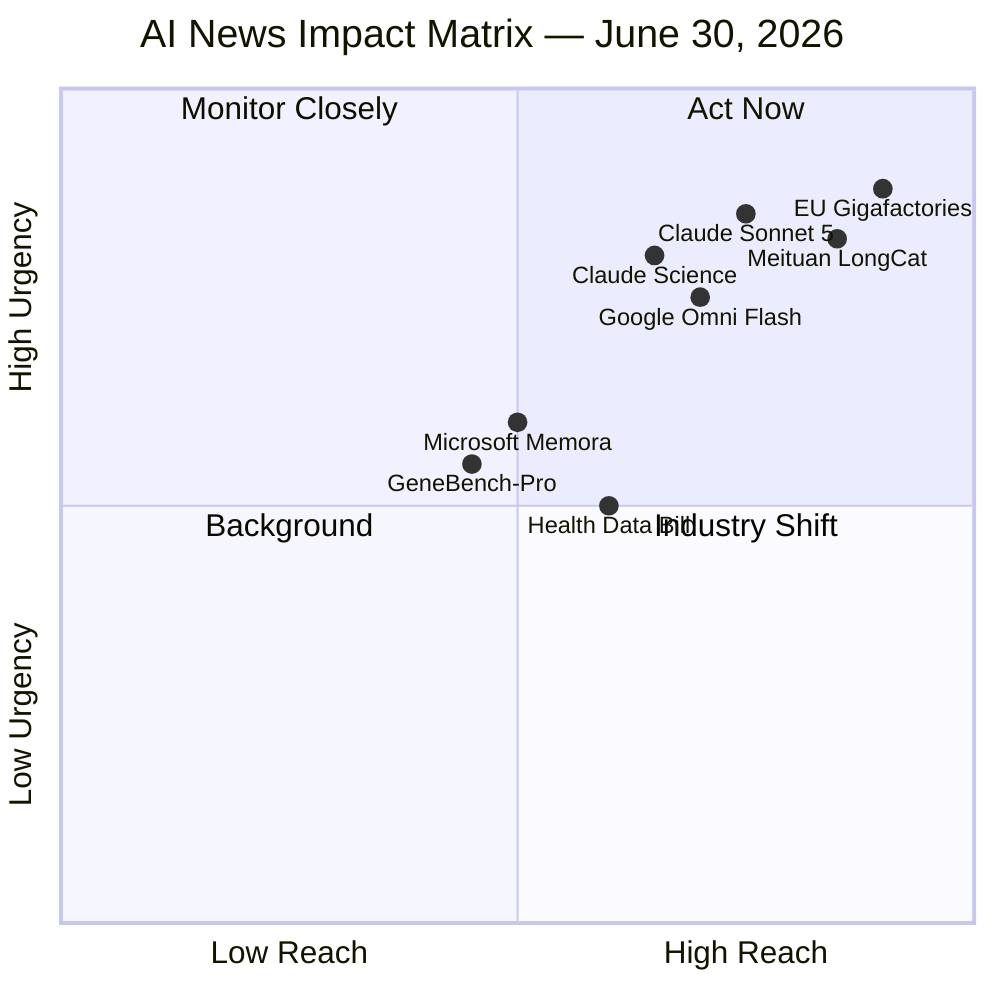

# AI Morning Digest — Tuesday, June 30, 2026
**Coverage window:** Last 24 hours (June 29, 6:00 AM UTC → June 30, 6:00 AM UTC)  
**Compiled:** June 30, 2026

---

## How sources were validated (PHIA framework)

This digest applies the UK **Professional Head of Intelligence Assessment (PHIA)** standards for rigor and independence, combined with **Ad Fontes Media Bias Chart** reliability tiers to filter politically biased or low-credibility outlets.

### PHIA validation wheel (per story)

Each story is scored on six PHIA-aligned dimensions:

| Segment | Green (trusted) | Amber (caution) | Red (excluded) |
|---------|-----------------|-----------------|----------------|
| **Independence** | Primary reporting, wire services, peer-reviewed | Industry blogs with disclosed affiliations | Politically motivated framing, partisan advocacy |
| **Evidence source** | Company announcements, Reuters/AP, official docs | Single secondary outlet | Unverified social posts, aggregators |
| **Consensus** | Multiple independent corroborations | Emerging / contested claim | Contradicts established reporting |
| **Currency** | Published within 24h | 24–48h with ongoing relevance | Stale or undated |
| **Limitations stated** | Benchmarks, preview status, beta caveats noted | Partial caveats | Hype without qualifiers |
| **Statistical claims** | Verified against primary source | Rounded or secondary citation | Unsubstantiated market/performance claims |

**Sources excluded** (hyper-partisan, low reliability, or aggregator-only): Memeburn, AIToolsRecap, Yahoo News reposts, Android Headlines, eWeek, partisan political blogs.

**Sources used** (Ad Fontes green-box or primary): Anthropic, OpenAI, Google, Microsoft Research, Reuters, The Verge, TechCrunch, InfoWorld, The Next Web, South China Morning Post.

---

## Impact legend

```
IMPACT SEVERITY          SCOPE
━━━━━━━━━━━━━━━━━━━━━━━━━━━━━━━━━━━━━━━━━━━━━━
🔴 Critical              🌍 Global economy / geopolitics
🟠 High                  🏢 Major company / industry shift
🟡 Moderate              🇺🇸 US policy / regulation
🟢 Emerging              🔬 Research & benchmarks
```

---

## Top stories

### 1. Anthropic ships Claude Sonnet 5 — flagship-class agents at mid-tier price

| Field | Detail |
|-------|--------|
| **Impact** | 🟠 **High** → 🏢 **Anthropic / Enterprise AI market** |
| **PHIA confidence** | **High** — primary source + multiple independent tech outlets |
| **Probability** | **Almost certain** (official product launch, live today) |

Anthropic released **Claude Sonnet 5**, positioning it as its most agentic Sonnet model yet — capable of planning, browser/terminal tool use, and autonomous workflows previously requiring Opus-class models. It is now the default for Free and Pro users and available via API as `claude-sonnet-5`.

**Pricing:** Introductory $2/M input, $10/M output tokens through Aug 31, 2026; then $3/$15.

**Why it matters:** Compresses the gap between mid-tier and flagship models, intensifying price competition with OpenAI's GPT-5.6 Terra tier ahead of both companies' expected IPOs.

**Sources:**
- [Anthropic — Introducing Claude Sonnet 5](https://www.anthropic.com/news/claude-sonnet-5) *(Primary, High confidence)*
- [The Verge — Anthropic's Claude Sonnet 5 is here](https://www.theverge.com/ai-artificial-intelligence/959686/anthropics-claude-sonnet-5-is-here) *(Green-box tech press)*

---

### 2. Anthropic launches Claude Science — AI workbench for researchers

| Field | Detail |
|-------|--------|
| **Impact** | 🟠 **High** → 🔬 **Scientific research / Pharma vertical** |
| **PHIA confidence** | **High** — primary announcement + TechCrunch corroboration |
| **Probability** | **Almost certain** (beta live today) |

Anthropic introduced **Claude Science**, a dedicated macOS/Linux workbench integrating 60+ scientific databases, MCP connectors, HPC clusters (SSH/Modal), and auditable research artifacts. It is **not a new model** — it runs standard Claude (including Opus 4.8). Beta available on Pro, Max, Team, and Enterprise plans.

**Funding:** Up to 50 research projects will receive up to $30,000 in credits (applications close July 15).

**Why it matters:** Signals Anthropic's vertical strategy (mirroring Claude Code for software) and directly competes with OpenAI's science benchmarking push on the same day.

**Sources:**
- [Anthropic — Claude Science workbench](https://www.anthropic.com/news/claude-science-ai-workbench) *(Primary)*
- [TechCrunch — Claude Science bets on workflow](https://techcrunch.com/2026/06/30/anthropics-claude-science-bets-on-workflow-not-a-new-model-to-win-over-scientists/) *(Independent corroboration)*

---

### 3. OpenAI releases GeneBench-Pro — biology benchmark for AI agents

| Field | Detail |
|-------|--------|
| **Impact** | 🟢 **Emerging** → 🔬 **AI-for-science evaluation** |
| **PHIA confidence** | **High** — primary source + public dataset on Hugging Face |
| **Probability** | **Almost certain** |

OpenAI published **GeneBench-Pro**, a 129-problem benchmark across genomics, quantitative biology, and translational medicine testing judgment-heavy computational biology. GPT-5.6 Sol scored **28.7%** pass rate (31.5% with Pro mode). Ten case studies are public on Hugging Face.

**Why it matters:** Sets a measurable bar for AI scientific reasoning; scores show frontier models still fail most problems — tempering hype around AI replacing researchers.

**Sources:**
- [OpenAI — Introducing GeneBench-Pro](https://openai.com/index/introducing-genebench-pro/) *(Primary)*
- [Hugging Face — genebench-pro-public-package](https://huggingface.co/datasets/ajh-oai/genebench-pro-public-package) *(Auditable dataset)*

---

### 4. Google opens Gemini Omni Flash & Nano Banana 2 Lite APIs to developers

| Field | Detail |
|-------|--------|
| **Impact** | 🟠 **High** → 🏢 **Google / Creative & enterprise media** |
| **PHIA confidence** | **High** — Google blog + API changelog |
| **Probability** | **Almost certain** (public preview live) |

Google released two generative media models to developers:
- **Gemini Omni Flash** (`gemini-omni-flash-preview`): conversational video generation/editing, 3–10s at 720p, **$0.10/second** of output
- **Nano Banana 2 Lite** (`gemini-3.1-flash-lite-image`): ultra-fast image generation at **$0.034/image** (1K)

Both include SynthID watermarks and C2PA credentials. Available via Gemini API, AI Studio, and Gemini Enterprise Agent Platform.

**Why it matters:** Brings Google's I/O consumer demos into production APIs, undercutting video generation costs and enabling chained image→video workflows for enterprises.

**Sources:**
- [Google Blog — Omni Flash & Nano Banana 2 Lite](https://blog.google/innovation-and-ai/models-and-research/gemini-models/gemini-omni-flash-nano-banana-2-lite/) *(Primary)*
- [Gemini API Changelog — June 30, 2026](https://ai.google.dev/gemini-api/docs/changelog) *(Official documentation)*

---

### 5. EU receives 76 bids for €20B AI gigafactory program

| Field | Detail |
|-------|--------|
| **Impact** | 🔴 **Critical** → 🌍 **EU tech sovereignty / Global AI infrastructure** |
| **PHIA confidence** | **High** — Reuters wire, official EU press conference |
| **Probability** | **Highly likely** (official EU announcement) |

EU tech chief Henna Virkkunen announced **76 submissions** from companies across 16 member states and 60 sites to build four AI gigafactories (each ~100,000 state-of-the-art AI chips), backed by **€20 billion** in EU funding. Applicants collectively plan to acquire **3+ million** latest-generation GPUs.

**Why it matters:** Europe's most concrete step toward reducing dependence on US hyperscalers; signals massive capital flowing into sovereign AI compute.

**Sources:**
- [Reuters — Europe's AI gigafactory push attracts 76 bids](https://www.reuters.com/sustainability/boards-policy-regulation/europes-ai-gigafactory-push-attracts-76-bids-eu-tech-chief-says-2025-06-30/) *(Wire service, least biased)*

---

### 6. Meituan open-sources LongCat-2.0 — 1.6T-parameter model on domestic Chinese chips

| Field | Detail |
|-------|--------|
| **Impact** | 🔴 **Critical** → 🌍 **US-China chip race / Geopolitics** |
| **PHIA confidence** | **Moderate** — company claim; chip vendor not named; corroborated by Reuters/SCMP |
| **Probability** | **Likely** (model weights released; chip claim unverified by third party) |

Meituan open-sourced **LongCat-2.0**, a 1.6-trillion-parameter model claiming end-to-end training on a 50,000-chip domestic cluster. Meituan reports 59.5 on SWE-bench Pro (vs. GPT-5.5's 58.6). Use of Huawei's HCCL library suggests domestic silicon involvement, though specific chips were not disclosed.

**Why it matters:** If verified, it demonstrates China's ability to train frontier-scale models without NVIDIA's latest hardware — directly challenging US export control strategy.

**Limitations:** Software ecosystem maturity vs. NVIDIA acknowledged by Meituan; domestic chip identity unconfirmed.

**Sources:**
- [The Next Web — Meituan domestic chips](https://thenextweb.com/news/chinas-meituan-says-its-new-ai-model-was-trained-on-domestic-chips) *(Tech press)*
- [South China Morning Post — China debuts biggest AI model on local chips](https://www.scmp.com/tech/tech-trends/article/3358854/china-debuts-biggest-ai-model-trained-local-chips-meituan-releases-longcat-20) *(Regional wire)*

---

### 7. Microsoft Research unveils Memora — agent memory architecture

| Field | Detail |
|-------|--------|
| **Impact** | 🟢 **Emerging** → 🔬 **AI agents / Infrastructure** |
| **PHIA confidence** | **High** — peer-reviewed (ICML 2026), open-source code |
| **Probability** | **Almost certain** (published research; not yet in products) |

Microsoft Research released **Memora**, a harmonic memory framework decoupling storage from retrieval via abstractions and cue anchors. On LoCoMo (600-turn dialogues) and LongMemEval (115K-token contexts), it achieved **86.3%** and **87.4%** accuracy while cutting token usage up to **98%** vs. full-context inference.

**Why it matters:** Addresses a core bottleneck for long-running AI agents; code is on GitHub but not yet integrated into Copilot products.

**Sources:**
- [Microsoft Research — Memora blog](https://www.microsoft.com/en-us/research/blog/memora-a-harmonic-memory-representation-balancing-abstraction-and-specificity/) *(Primary)*
- [InfoWorld — Microsoft unveils Memora](https://www.infoworld.com/article/4191031/microsoft-unveils-memora-to-tackle-ai-agents-memory-problem.html) *(Independent tech press)*

---

### 8. US lawmakers propose ban on selling AI chatbot health data

| Field | Detail |
|-------|--------|
| **Impact** | 🟡 **Moderate** → 🇺🇸 **US privacy regulation** |
| **PHIA confidence** | **Moderate** — bill announced, not yet introduced or passed |
| **Probability** | **Realistic possibility** (legislation faces uncertain Congressional path) |

Sen. Elizabeth Warren (D-MA) and Rep. Mary Gay Scanlon (D-PA) plan to introduce an updated **Health and Location Data Protection Act** banning sale of health/location data — including information entered into AI chatbots — to data brokers. Would empower FTC enforcement with $1B over 10 years.

**Why it matters:** First major federal proposal specifically targeting AI health data monetization as users increasingly upload medical records to ChatGPT, Claude, and similar tools.

**Independence note:** This is a legislative proposal from Democratic lawmakers; reported factually without endorsing policy position, per PHIA independence standard.

**Sources:**
- [The Verge — Lawmakers want to ban AI companies from selling health data](https://www.theverge.com/ai-artificial-intelligence/959033/health-location-data-protection-act-ai-warren-scanlon) *(Green-box tech/policy reporting, June 29)*

---

## Impact map (visual summary)



---

## Story count by impact area

| Impact area | Stories | Severity |
|-------------|---------|----------|
| 🏢 **Company — Anthropic** | Claude Sonnet 5, Claude Science | 🟠 High |
| 🏢 **Company — OpenAI** | GeneBench-Pro | 🟢 Emerging |
| 🏢 **Company — Google** | Omni Flash, Nano Banana 2 Lite | 🟠 High |
| 🏢 **Company — Microsoft** | Memora | 🟢 Emerging |
| 🏢 **Company — Meituan** | LongCat-2.0 | 🔴 Critical |
| 🌍 **Global / Geopolitics** | EU gigafactories, China chip independence | 🔴 Critical |
| 🇺🇸 **US Policy** | Health data privacy bill | 🟡 Moderate |
| 🔬 **Research** | GeneBench-Pro, Memora | 🟢 Emerging |

---

## What to watch next (24–72 hours)

1. **IPO signals** — Both Anthropic and OpenAI are in pre-IPO phases; Sonnet 5 pricing may be strategically timed.
2. **GPT-5.6 general availability** — OpenAI says broader rollout coming "in the weeks ahead" after government-vetted preview.
3. **EU gigafactory shortlist** — Official call for proposals expected end of 2026.
4. **LongCat-2.0 verification** — Independent benchmarks on domestic-chip training claims.

---

*Methodology: PHIA Common Analytical Standards (UK Gov) + Ad Fontes Media Bias Chart green-box sources. Political opinion outlets excluded. All claims cross-referenced against primary sources where available.*
